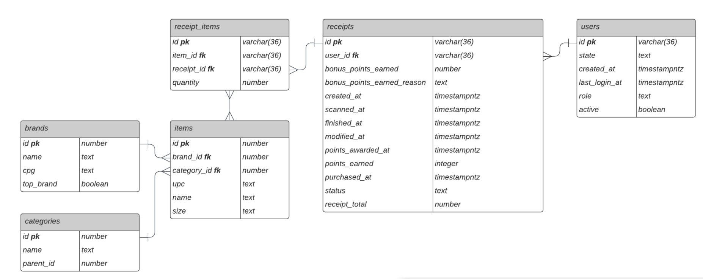

# Fetch Analytics Engineer

- [Data Model](#data-model)
- [SQL Queries](#sql-queries)
- [Data Quality Issues](#data-quality-issues)
- [Stakeholder Communication](#stakeholder-communication)

## ERD

My thinking with the ERD is that the table definitions receipts and brands needed further definition to be useful while users was more or less okay. Separating the items out of receipts allow for tieing the items back to the brands and breaking the brands table out into cpg, item, and brand makes it easier to query each of these individually as well as allowing for proper relation between tables.



## SQL Queries

- Query 1: Which brand has the most spend/transactions among users who were created within the past 6 months?
- [Solution](brand_metricssql)

- Query 2: When considering total number of items purchased from receipts with 'rewardsReceiptStatus’ of ‘Accepted’ or ‘Rejected’, which is greater?
- [Solution](receipt_item_status.sql)

## Data Quality Issues

For this section, I used Python with pandas to explore the data quality issues in the provided files. I focused on potential problem areas based on my experience with CPG and retail data.

### Category Codes

I first looked at the brands.json file to investigate the relationship between category and categoryCode fields:

```python
import pandas as pd
import numpy as np

df = pd.read_json('brands.json', lines=True)

print("Columns:", list(df.columns))
# Output: ['_id', 'barcode', 'category', 'categoryCode', 'cpg', 'name', 'topBrand', 'brandCode']

missing_codes = df[(df['category'].notna()) & (df['categoryCode'].isna())]
# Output: 495 rows

print(missing_codes[['_id', 'category', 'categoryCode']].head(5))
# Output shows records with categories but null categoryCode
```

I then checked if this was consistent across all values of a specific category:

```python
baking_items = df[df['category'] == 'Baking'][['_id', 'category', 'categoryCode']]
print(f"Total 'Baking' items: {len(baking_items)}")

# Check if any "Baking" items have categoryCode
with_code = baking_items[baking_items['categoryCode'].notna()]
print(f"'Baking' items with category code: {len(with_code)}")
print(f"'Baking' items missing category code: {len(baking_items) - len(with_code)}")

# Sample of Baking items with codes
print(with_code.head())
```

### Brand Codes

I also checked for consistency in brandCode field:

```python
# Check for null brandCode values
print(f"Records with null brandCode: {df['brandCode'].isna().sum()}")

# Check if there are multiple brand codes for the same barcode
barcode_brandcode = df.groupby('barcode')['brandCode'].nunique()
multiple_codes = barcode_brandcode[barcode_brandcode > 1]
print(f"Barcodes with multiple brand codes: {len(multiple_codes)}")
```

### User Data

I checked the users.json file for potential duplicate users:

```python
users_df = pd.read_json('users.json', lines=True)

# Check for duplicate user IDs
user_counts = users_df['_id'].value_counts()
duplicates = user_counts[user_counts > 1]
print(f"Number of duplicate user IDs: {len(duplicates)}")
print("Sample duplicate IDs:")
print(duplicates.head())
```

### Receipt Data

I checked the receipts.json file for missing data:

```python
receipts_df = pd.read_json('receipts.json', lines=True, nrows=1000)

# Check for items without barcode in receipt items
items_df = pd.json_normalize(
    receipts_df['rewardsReceiptItemList'].dropna().explode().tolist()
)
if 'barcode' in items_df.columns:
    print(f"Receipt items missing barcode: {items_df['barcode'].isna().sum()} out of {len(items_df)}")
```

## Stakeholder Communication

```
Hey Team,

Thank you for getting the sample data from The Bluth Company over to me. I've had some time to look over the data and it's in relatively good shape but I have a few questions and concerns that we need to cover with the partner.

- Are they wanting to deliver this data on a regular cadence and if so how are they going to deliver it? We have a few options available for them : SFTP, s3, or GCS.
- Are they able to provide us any additional item information beyond the barcode/upc that is in the file? That would be extremely helpful for us to have.
- I noticed an inconsistency when doing a data quality check. It appears that brands data is incomplete wrt the categoryCode. We can backfill that ourselves if need be but if they can provide it that would be great.
- Do we know how large the data sets are going to be? I have a concern about resource allocation in the pipeline so getting a good idea of typical size for each of these files and delivery cadence will help us determine memory requirements.

If I need to get on a call to go over any of this with them I am happy to do that, thanks!
```
